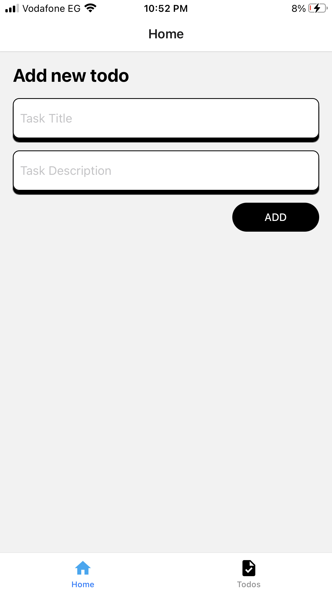
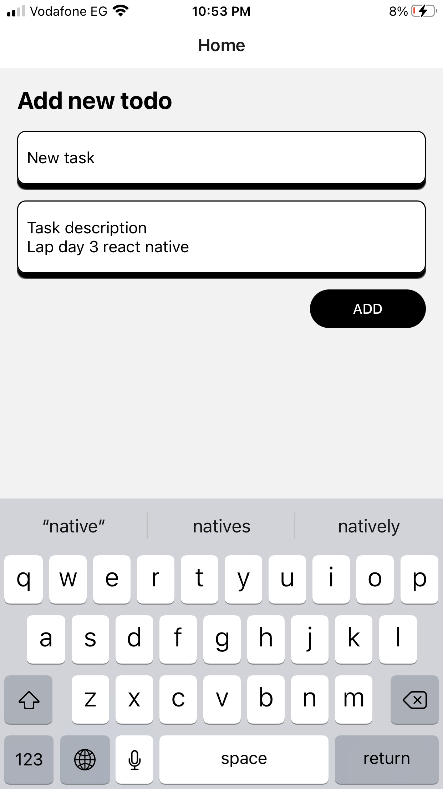
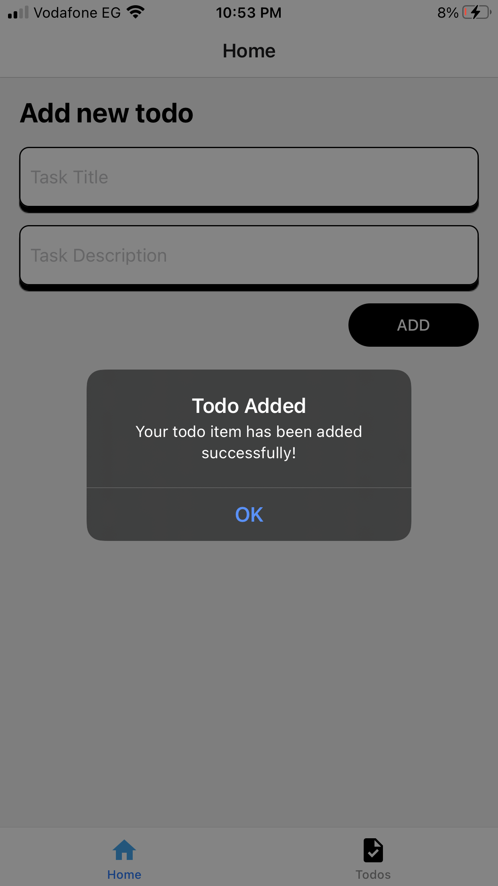
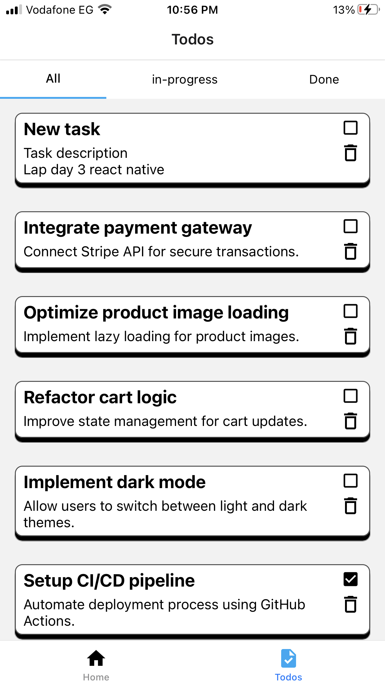
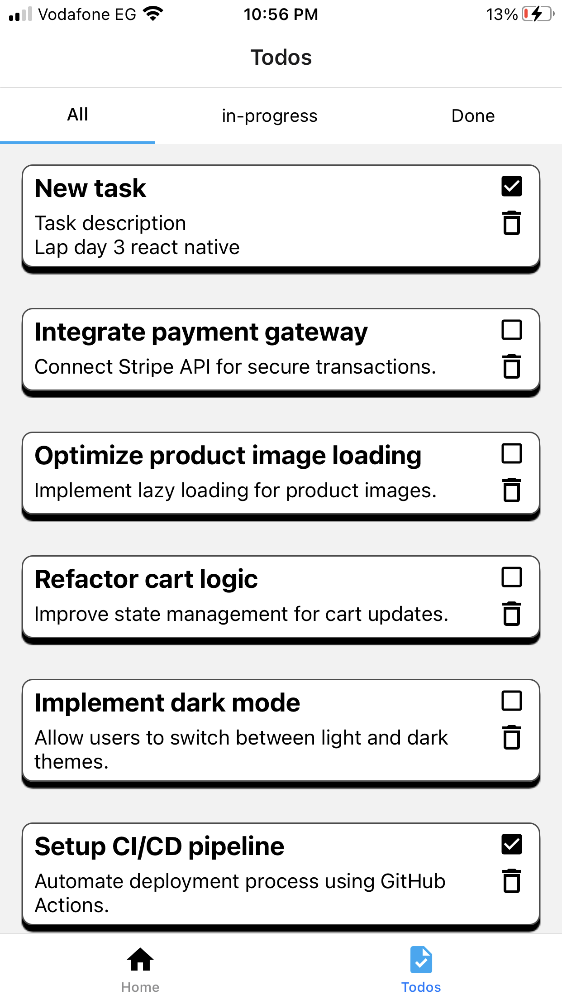
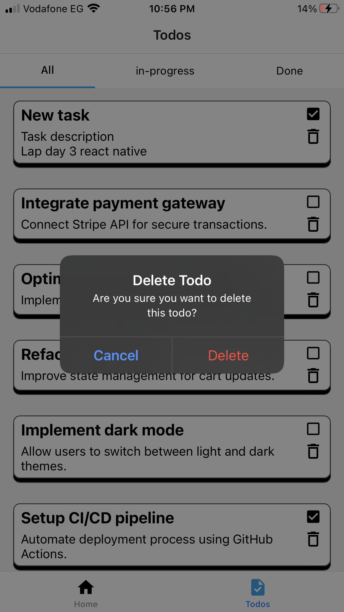
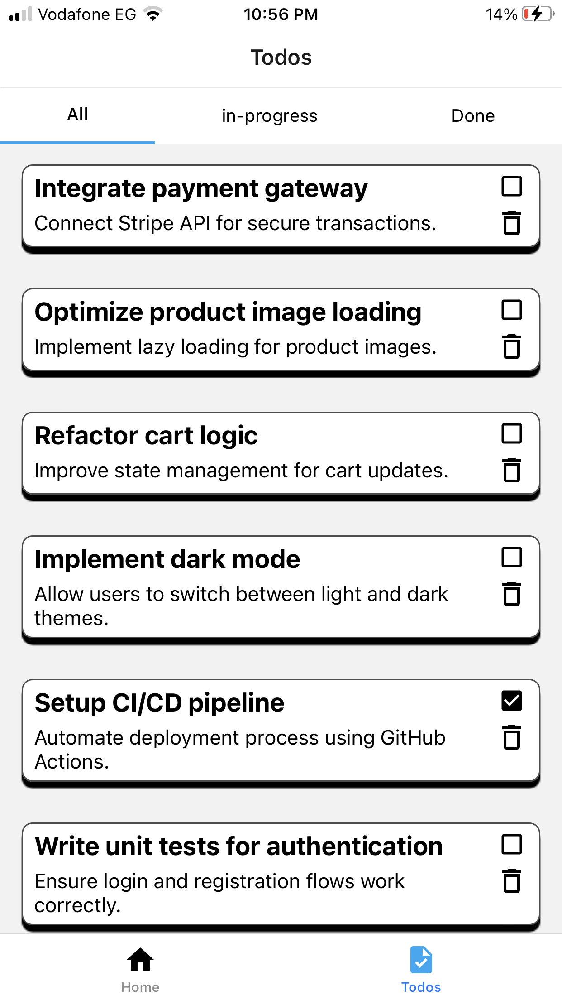
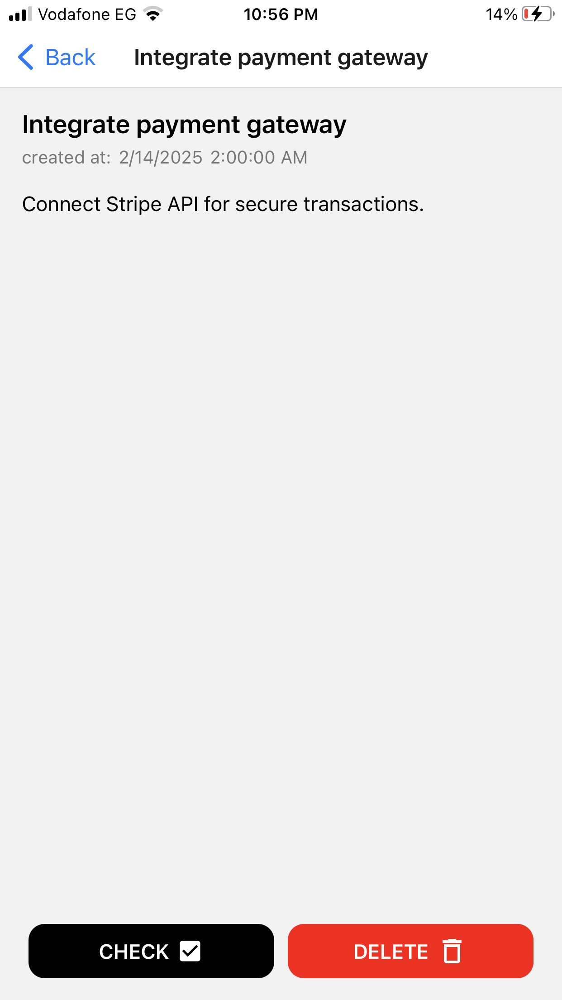

# Todo App - A React Native Todo Application

This is my first project built with **React Native**. I created this Todo App to implement and showcase the concepts I learned, including state management, navigation, persistent storage, and UI design. The app is a fully functional task manager that lets users add, update, and delete tasks, as well as filter them by status.

---

## Detailed Overview

This Todo App demonstrates key React Native concepts:

- **State Management with Context API:**  
  The app uses React's Context API to globally manage todos. A custom hook (`useTodos`) and a `TodosProvider` wrap the app to allow easy access to actions like adding, updating, and deleting tasks.

- **Asynchronous Storage with AsyncStorage:**  
  Todos are persisted locally using AsyncStorage. This ensures that task data remains available even after the app is closed or restarted.

- **Navigation:**  
  The project utilizes navigation (e.g., React Navigation) to move between screens. For example, tapping on a task navigates to a detailed view, where you can mark a task as done or delete it.

- **UI Components & Styling:**  
  The app is built with several reusable components:
  - **AddNewTask:** For inputting new tasks.
  - **Tabs:** To filter tasks by status (All, In-progress, Done).
  - **Todo & TodoList:** For displaying and interacting with each task.
  
  Icons from the Material Icons library (via `react-native-vector-icons`) enhance the user experience by visually representing actions like marking a task complete or deleting a task.

- **Learning and Experimentation:**  
  Being my first React Native project, this app is a playground for learning about component-based architecture, hooks like `useState` and `useEffect`, and effective state management using Context API.

---

## Technologies Used

- **React Native:**  
  A powerful framework for building mobile applications using JavaScript and React. It allows you to create native apps for both iOS and Android with a single codebase.

- **React Navigation:**  
  Used for navigating between different screens in the app. It simplifies routing and managing the navigation state.

- **AsyncStorage:**  
  A simple, asynchronous key-value storage system that allows the app to persist data locally on the device.

- **Context API:**  
  A built-in React feature used to share state (the todos list) across components without having to pass props down manually at every level.

- **Material Icons (react-native-vector-icons):**  
  Provides a collection of icons that enhance the UI. Icons are used for actions such as marking tasks complete or deleting them.

---

## Project Structure

Below is the basic folder structure for the project:

```
📂 todo-app
├── 📂 components
│   ├── AddNewTask.js      // Component for adding a new task
│   ├── Tabs.js            // Component for filtering tasks by status
│   ├── Todo.js            // Component for displaying a single task
│   ├── TodoList.js        // Component for listing all tasks
├── 📂 context
│   └── TodosContext.js    // Context API provider for todos state management
├── 📂 screens
│   ├── HomeScreen.js      // Screen for adding tasks
│   ├── TodosScreen.js     // Screen for viewing tasks with filters
│   └── TodoScreen.js      // Screen for detailed view of a single task
├── 📂 data
│   └── todosData.js       // Initial sample data for todos
├── App.js                 // Main app entry point
└── package.json           // Project metadata and dependencies
```

---

## Screenshots

Here are the key screens demonstrating how the app works:

1. **Home Page**  
     
   *This is the initial screen where you can add a new task by providing a title and description.*

2. **Type Input Description**  
     
   *Shows the user typing in a task description.*

3. **After Press Add**  
     
   *An alert confirms that the new task has been successfully added.*

4. **Tasks Page After Add**  
     
   *The newly added task appears in the task list on the Todos page.*

5. **Tasks Page - Task Checked**  
     
   *A task is marked as ‘done’ by tapping the checkbox.*

6. **Delete Task**  
     
   *A confirmation prompt appears before deleting a task.*

7. **Task After Task Deleted**  
     
   *The task is removed from the list after deletion.*

8. **Task Detail Page**  
     
   *A detailed view of a task showing its title, description, and creation date/time, with the ability to mark it as done or delete it.*

---

## Installation & Setup

1. **Clone the Repository:**
   ```sh
   git clone https://github.com/your-username/todo-app.git
   cd todo-app
   ```

2. **Install Dependencies:**
   ```sh
   npm install
   ```
   or if using Yarn:
   ```sh
   yarn install
   ```

3. **Start the Development Server:**
   ```sh
   npx expo start
   ```
   This will start the Expo development server. You can then run the app on an emulator or a physical device using the Expo client.

---

## Usage

- **Add a Task:**  
  Navigate to the Home screen and use the "Add new todo" form. Enter a task title and description, then press the "ADD" button.

- **Manage Tasks:**  
  On the Todos screen, use the tabs to filter tasks by their status:
  - **All:** View every task.
  - **In-progress:** View tasks that are not yet completed.
  - **Done:** View tasks that have been marked complete.
  
- **Task Actions:**  
  In the task list:
  - **Mark as Done/In-progress:** Toggle the status by clicking on the checkbox icon.
  - **Delete a Task:** Press the delete icon to remove the task after confirming the action.

- **View Details:**  
  Tap on any task to navigate to the Todo Details screen, where you can see more information and perform actions like updating the status or deleting the task.

---

## Contributing

If you'd like to contribute to this project, please follow these steps:

1. **Fork the Repository**
2. **Create a New Branch:**
   ```sh
   git checkout -b feature/your-feature
   ```
3. **Commit Your Changes:**
   ```sh
   git commit -m "Add new feature"
   ```
4. **Push to Your Branch:**
   ```sh
   git push origin feature/your-feature
   ```
5. **Submit a Pull Request**

---

## License

This project is licensed under the MIT License. See the [LICENSE](LICENSE) file for details.
