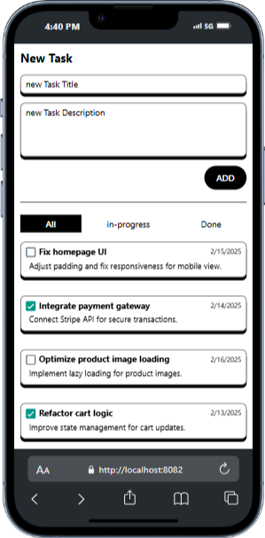
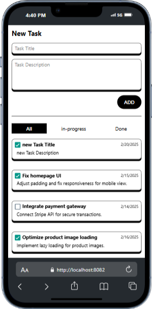
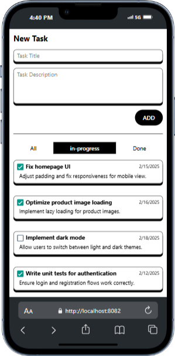
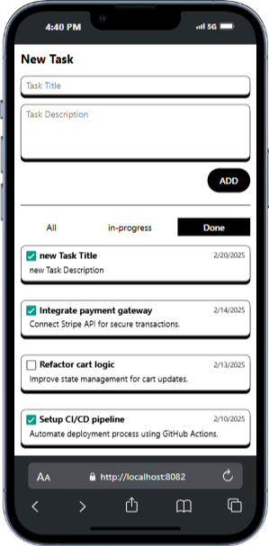

## Project Overview
The **Todo App** is a task management application built using **React Native**. It enables users to add, track, and manage their tasks efficiently with filtering options for different task statuses.

## Screenshots

### Typing a New Task


### Task Added Successfully


### Changing Task Status to Done


### Viewing In-Progress Tasks


### Viewing Done Tasks


## Features
- Add new tasks with a title and description
- Mark tasks as "done" or "in-progress"
- Filter tasks based on their status
- Persistent state management
- Responsive UI using React Native Web

## 🛠 Tech Stack
- **React Native**
- **React Native Web**
- **JavaScript (ES6+)**
- **React Hooks (useState)**
- **Expo (if applicable)**

---

## 📂 Project Structure
```
📂 todo-app
 ┣ 📂 components
 ┃ ┣ 📄 AddNewTask.js
 ┃ ┣ 📄 Tabs.js
 ┃ ┣ 📄 TodoList.js
 ┃ ┗ 📄 Todo.js
 ┣ 📂 data
 ┃ ┗ 📄 todosObj.js
 ┣ 📄 App.js
 ┣ 📄 package.json
 ┣ 📄 README.md
 ┗ 📄 .gitignore
```

---

## Installation & Setup

### Prerequisites
Ensure you have the following installed:
- **Node.js** (LTS version recommended)
- **npm** or **yarn**
- **Git**

### Clone the Repository
```sh
git clone https://github.com/YOUR_GITHUB_USERNAME/todo-app.git
cd todo-app
```

### 3️⃣ Install Dependencies
```sh
npm install
# or
yarn install
```

### Run the Application
For **React Native Web (Expo/Web):**
```sh
npm start
# or
yarn start
```

For **React Native CLI (Android/iOS):**
```sh
npx react-native run-android   # For Android
npx react-native run-ios       # For iOS
```

---

## Version Control & GitHub Integration

### Initialize Git
```sh
git init
```

### Add a Remote Repository
Create a new repository on GitHub, then link it:
```sh
git remote add origin https://github.com/YOUR_GITHUB_USERNAME/todo-app.git
```

### Add and Commit Code
```sh
git add .
git commit -m "Initial commit"
```

### Push to GitHub
```sh
git branch -M main
git push -u origin main
```

---

## Contributing Guidelines
1. **Fork the repository**
2. **Create a new branch** (`git checkout -b feature-name`)
3. **Make your changes**
4. **Commit the changes** (`git commit -m "Added new feature"`)
5. **Push to your fork** (`git push origin feature-name`)
6. **Create a pull request** on GitHub

---

## License
This project is licensed under the **MIT License**.

---

## Contact & Support
For any issues or feature requests, please open an **issue** on GitHub or contact me at **your-email@example.com**.

---
